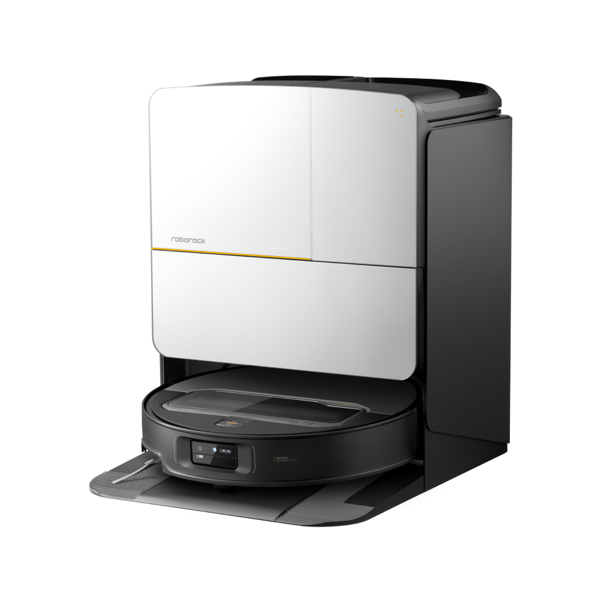
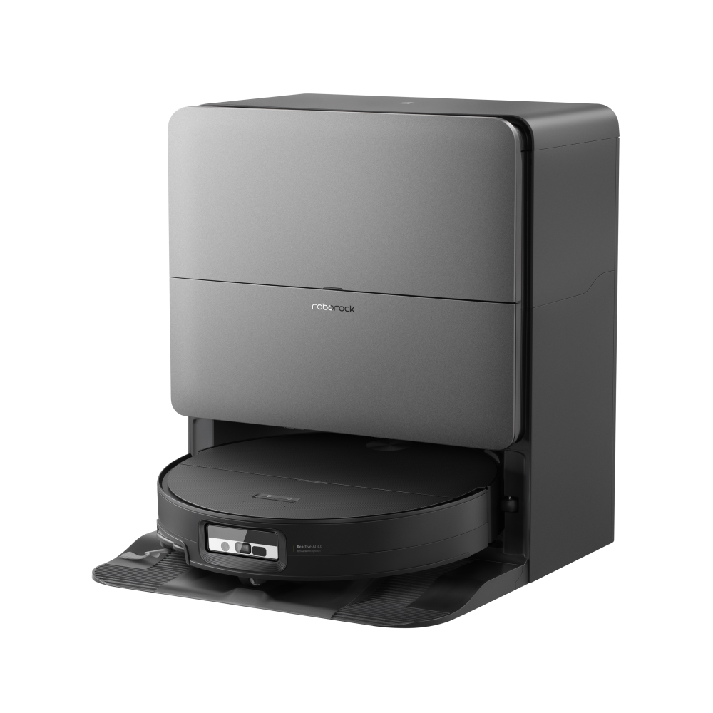
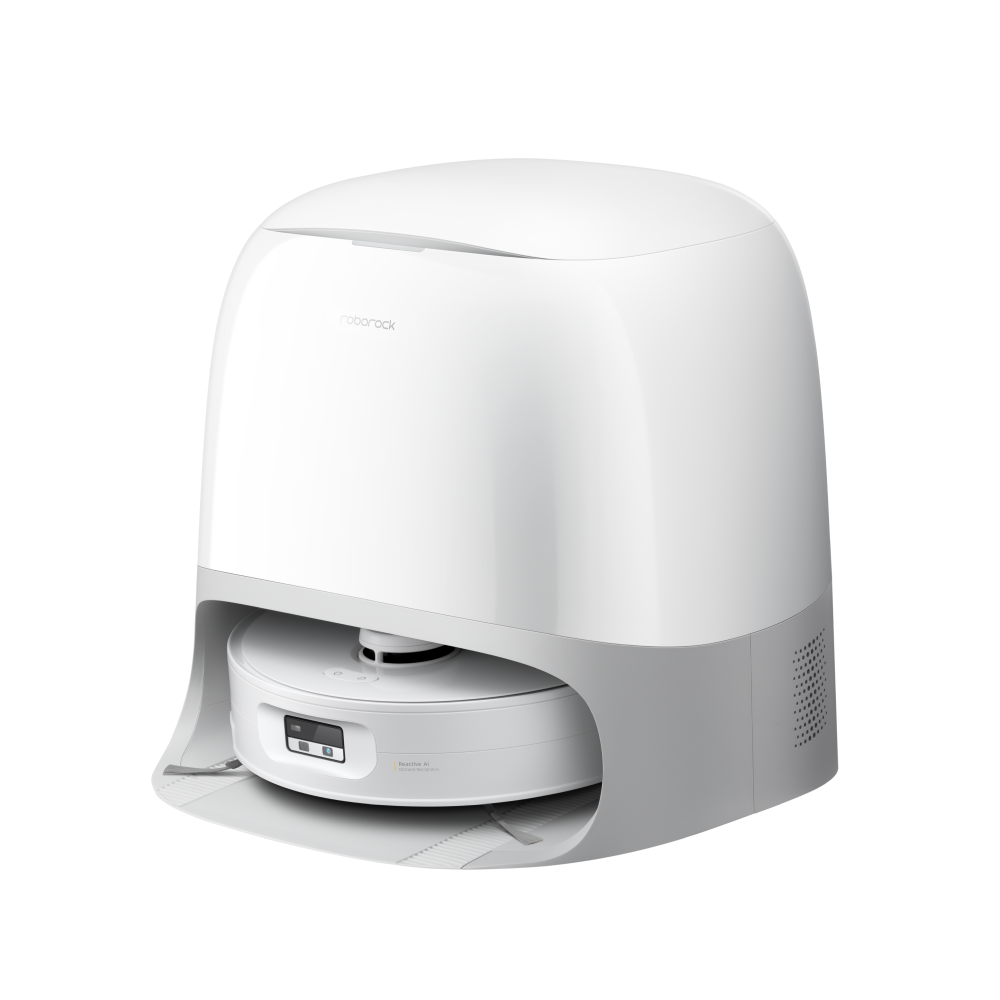
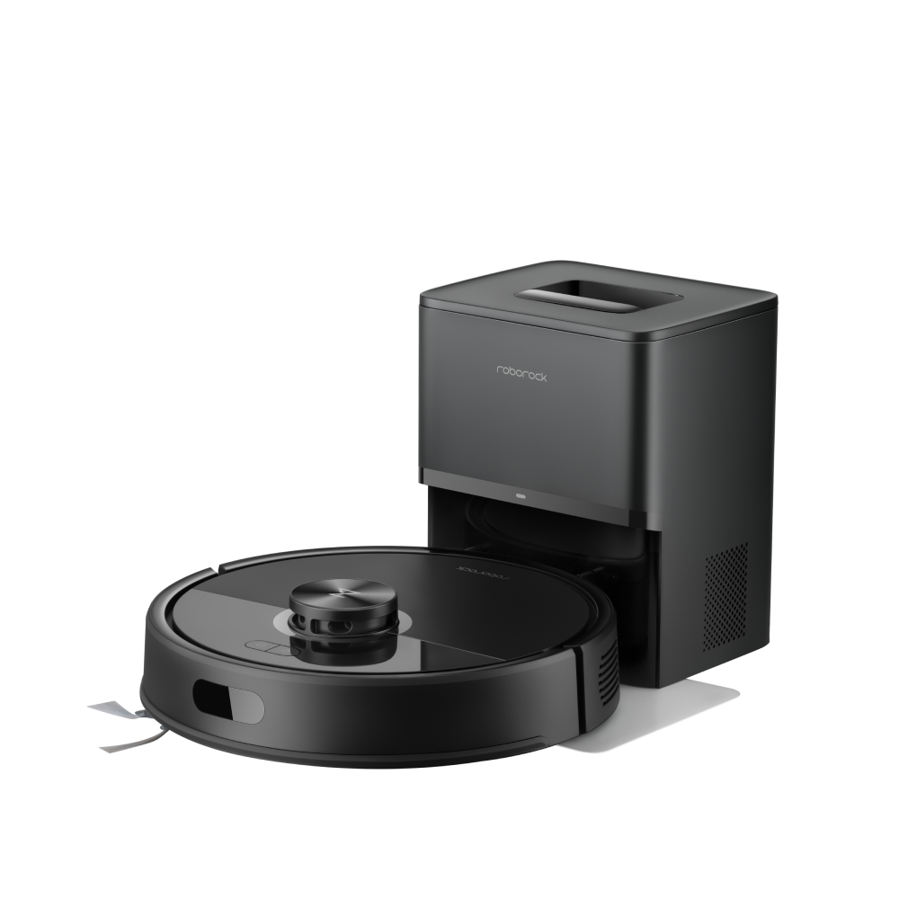
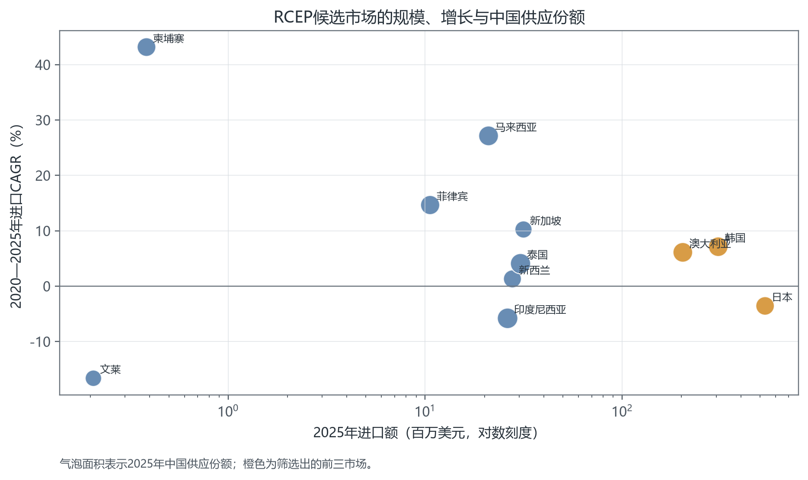
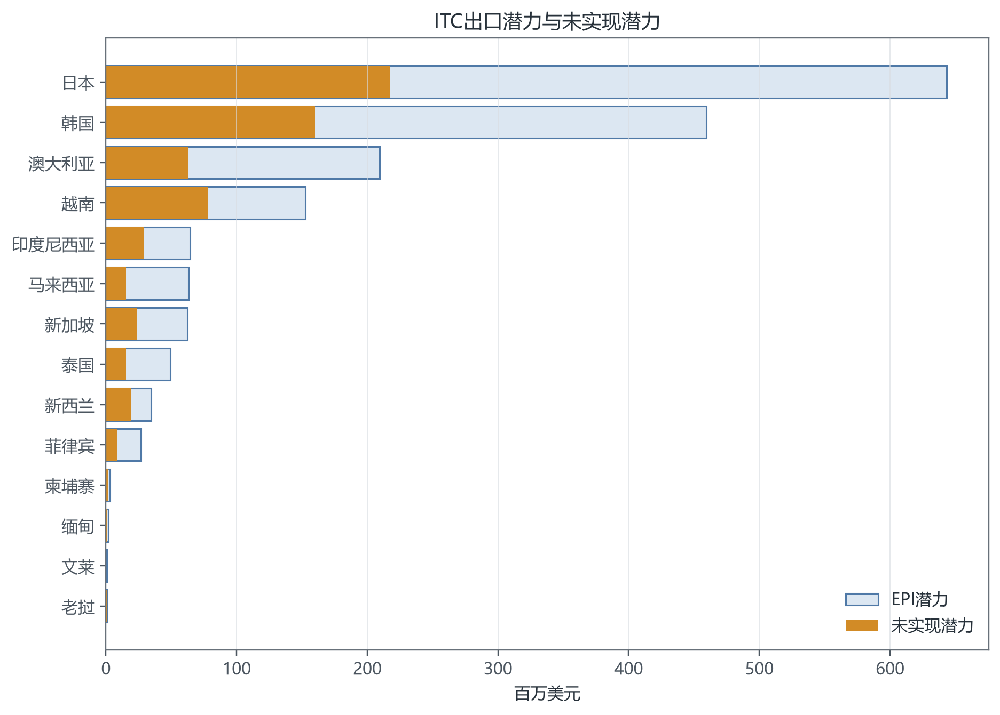
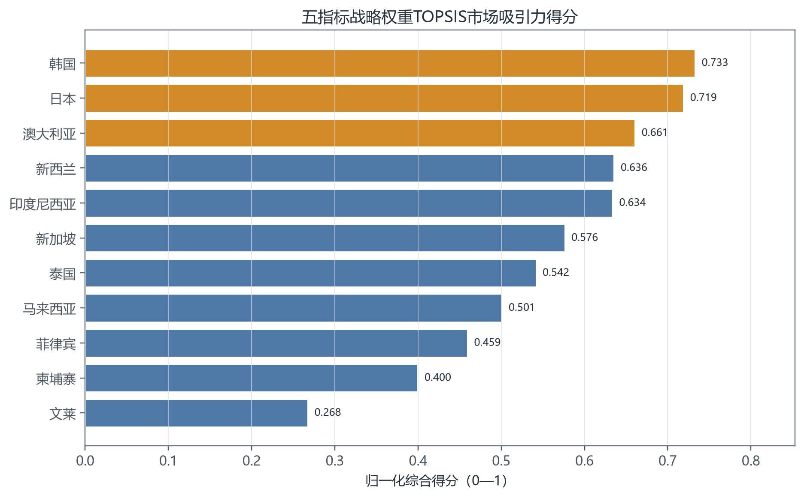
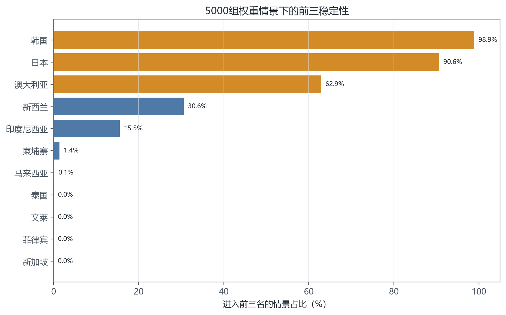
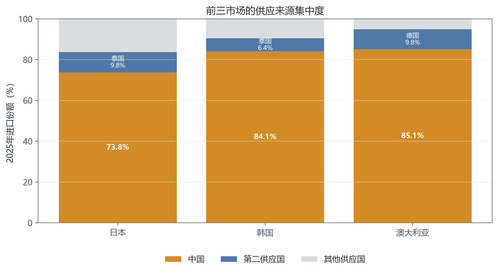

<!-- _class: cover -->
<!-- _paginate: false -->

# 石头科技扫地机产品在RCEP区域的国际市场开拓

HS 85098090.00｜答辩展示

<table class="team">
<tr><td>朱妍</td><td>国际经济与贸易（国际贸易/金融风险管理）25-4</td><td>2025311438</td></tr>
<tr><td>黄孝睿</td><td>经济学基地班25</td><td>2025311204</td></tr>
<tr><td>张语晗</td><td>金融学（北外联培25）</td><td>2025310319</td></tr>
</table>

---

# 研究结构

  
<b>产品界定</b>扫地机器人 中国税号85098090.00 ITC统计层级HS850980

  
›

  
<b>市场筛选</b>14个RCEP候选市场 Trade Map与EPI 11个市场进入排序

  
›

  
<b>模型验证</b>五指标TOPSIS 三套权重对照 5,000次敏感性分析

  
›

  
<b>进入方案</b>RCEP关税与原产地 韩国、日本、澳大利亚 分市场配置资源

资料来源：本组研究设计；ITC Trade Map、Export Potential Map、Market Access Map；《区域全面经济伙伴关系协定》。

---

# 产品与统计口径

## 石头科技扫地机器人

- 产品价值来自主机、基站、导航算法与售后服务
- 核心能力集中在环境感知、路径规划、清扫执行和基站自维护
- 海外市场采用全价格段产品矩阵

## 数据边界

<strong>85098090.00</strong>

中国海关申报码

<strong>HS 850980</strong>

ITC六位码产品组，用于比较市场环境，不等同于Roborock品牌销售额

资料来源：北京石头世纪科技股份有限公司《2025年年度报告》，第13—17页；中华人民共和国海关进出口税则，税号85098090；ITC HS850980产品说明。

---

# 产品矩阵：技术旗舰、全能基站与主流放量

  

    
    <h3>Saros Z70</h3>
    
<strong>22,000 Pa</strong>｜五轴机械臂

    
超薄机身、StarSight 2.0、基站4.0

  

  

    
    <h3>Saros 20 Sonic</h3>
    
<strong>36,000 Pa</strong>｜VibraRise 5.0

    
升降底盘、低矮空间通行

  

  

    
    <h3>Qrevo Curv 2 Flow</h3>
    
<strong>20,000 Pa</strong>｜实时自清洁滚筒

    
以拖地结构承接中高端需求

  

  

    
    <h3>Q7 Series</h3>
    
<strong>最高13,000 Pa</strong>｜LiDAR导航

    
覆盖主流与入门价格带

  

矩阵不是单向升级：机械臂、声波拖地、滚筒拖地和基础导航分别对应不同场景与价格带。

资料与图片来源：Roborock US Official Store “Robot Vacuums”“Saros Z70”“Saros 20 Sonic”“Qrevo Curv 2 Flow”；Roborock Global Official Store “Q7 Series”，访问日期2026年9月14日。

---

# 候选市场的规模与增长

数据来源：ITC Trade Map，HS850980，2020—2025年；中国为出口国。图中包括数据字段完整的11个RCEP候选市场，访问日期2026年9月5日。

---

# 出口潜力补足历史贸易的局限

EPI = Supply × Ease × Demand

Untapped = max(EPI − Actual, 0)

日本、韩国和澳大利亚的EPI绝对值领先。越南虽有潜力，但Trade Map关键字段不完整，本轮不进入综合排序。

数据来源：ITC Export Potential Map，中国向RCEP成员国出口HS850980的EPI与基准出口额，访问日期2026年9月5日；未实现潜力由本组逐市场计算。

---

# 五指标TOPSIS模型

| 指标 | 处理方式 | 权重 | 回答的问题 |
|---|---:|---:|---|
| 2025年进口额 | $\ln(1+x)$、Min—Max | 30% | 市场有多大 |
| 2020—2025年CAGR | Min—Max | 10% | 需求是否增长 |
| 中国供应份额 | Min—Max | 10% | 中国供给基础如何 |
| 未实现潜力金额 | $\ln(1+x)$、Min—Max | 30% | 还有多少空间 |
| 未实现潜力比例 | Min—Max | 20% | 潜力兑现到哪一步 |

Cᵢ = Dᵢ⁻ / (Dᵢ⁺ + Dᵢ⁻)　　贴近度越高，市场越接近理想组合

数据来源：ITC Trade Map与Export Potential Map；指标、变换及战略权重由本组设定。TOPSIS模型运行日期2026年9月6日。

---

# 综合排序指向韩国、日本和澳大利亚

韩国　<strong>0.733</strong>

日本　<strong>0.719</strong>

澳大利亚　<strong>0.661</strong>

韩国兼顾规模与增长，日本拥有最大需求池，澳大利亚在规模、增长和中国份额之间较均衡。

数据来源：ITC Trade Map、Export Potential Map与Market Access Map；本组按五指标战略权重TOPSIS模型计算，模型运行日期2026年9月6日。

---

# 权重扰动后的入选稳定性

<strong>韩国 98.9%</strong>

<strong>日本 90.6%</strong>

<strong>澳大利亚 62.9%</strong>

新西兰 30.6%

澳大利亚与新西兰是边界选择。澳大利亚2025年进口规模约为新西兰的7.3倍，因此保留澳大利亚。

数据来源：ITC模型输入；本组以战略权重为中心生成5,000组Dirichlet权重，随机种子850980，模型运行日期2026年9月6日。

---

# RCEP降低关税成本，原产资格决定能否使用规则

| 市场 | 对应税则线 | RCEP承诺 | ITC实际适用税率 |
|---|---|---|---:|
| 日本 | 850980.000 | Free | 0% |
| 韩国 | 8509.80.90.00 | 基准8%，第一年起0% | 0% |
| 澳大利亚 | 8509.80.90 | 基准及各年度0% | 0% |

## HS2022产品特定原产地规则：CTSH 或 RVC40

- CTSH：非原产材料发生六位子目改变
- RVC40：区域价值成分达到40%
- 第3.4条允许区域累积，RCEP成员方原产材料可计入原产成分

资料来源：《区域全面经济伙伴关系协定》第2章第2.4、2.6、2.7、2.14条，第3章第3.2、3.4条；附件一日本表第1133页、韩国对中国表第302页、澳大利亚表第102页；《产品特定原产地规则（HS2022）》税目8509.80，第118页；ITC Market Access Map，访问日期2026年9月5日。

---

# 中国供给占主导，竞争转向品牌与渠道

日本：中国份额 <strong>73.81%</strong>

韩国：中国份额 <strong>84.12%</strong>

澳大利亚：中国份额 <strong>85.12%</strong>

三国已接受中国供给。石头科技需要争取高端细分，并把售后响应写进渠道方案。

数据来源：ITC Trade Map，HS850980，日本、韩国和澳大利亚2025年按供应国进口数据，访问日期2026年9月5日。

---

<!-- _class: strategy -->

# 三国承担不同任务

| 市场 | 数据判断 | 产品与渠道重点 |
|---|---|---|
| **韩国** | 进口3.073亿美元；CAGR 7.12%；未实现潜力1.601亿美元 | 先建售后合作与备件仓，再投放全能基站款和旗舰款 |
| **日本** | 进口5.313亿美元；CAGR -3.57%；未实现潜力2.172亿美元 | 以中高端SKU争取存量替换，强调低噪、地图准确性和耗材供应 |
| **澳大利亚** | 进口2.031亿美元；CAGR 6.10%；未实现潜力0.632亿美元 | 测试大户型、地毯和毛发场景，统一零售与电商保修规则 |

资源不平均分配。韩国优先验证增长，日本争取最大需求池，澳大利亚验证英语市场复制。

数据来源：ITC Trade Map与Export Potential Map，HS850980，2025年；产品与渠道建议依据石头科技《2025年年度报告》第13—17页及本组市场分析。

---

# 执行节奏与复盘指标

  
<b>准备期｜第1季度</b>确认税则线与原产资格 完成认证和售后签约 确定核心SKU与备件

  
›

  
<b>试销期｜第2—3季度</b>围绕Prime Day首轮销售 记录转化、退货和维修 核算单台贡献毛利

  
›

  
<b>扩张期｜第4季度后</b>应对Black Friday 按市场调整预算与库存 用企业数据重跑模型

<strong>结论：韩国、日本、澳大利亚组成第一轮市场组合。</strong>

资料来源：北京石头世纪科技股份有限公司《2025年年度报告》“销售季节性风险”部分；RCEP第3章原产地规则；执行安排由本组根据ITC筛选结果设计。

---

<!-- _class: cover -->

# 谢谢

石头科技扫地机产品RCEP国际市场开拓策划

